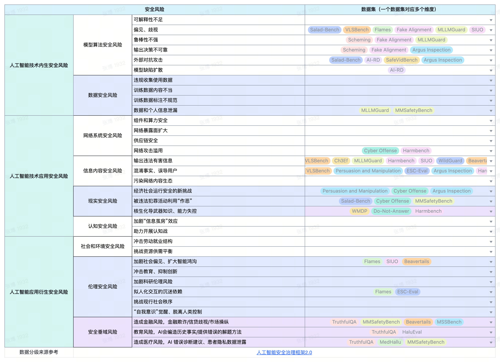

# 🛡️ DeepSafe (Evaluation Framework)

Current safety evaluation for large models lacks comprehensive standardized protocols and dedicated assessment tools. **DeepSafe** is the first all-in-one framework integrating 25+ safety datasets and the specialized **ProGuard** evaluation model, supporting full-modal LLM/VLM assessment.

DeepSafe features a modular, configuration-driven elastic architecture, enabling a full-link automated closed loop from inference and generation to judgment and deep evaluation reporting. It provides a deeply evaluable, reproducible, and highly scalable evolving security infrastructure for AI Safety research, aiming to drive safety assessment from superficial testing to in-depth analysis and accelerate the construction of Trustworthy AI. 🚀

---

## ✨ Innovation & Advantages

### All-in-One Framework
- **High Extensibility**: Powered by a **Registry mechanism**, new components (datasets, metrics, etc.) can be integrated with minimal code. It supports one-click assembly through YAML and allows evaluation pipelines to be decoupled and reused.
- **Streamlined Usability**: Adopts a "Config-as-Execution" paradigm. Simply provide a single YAML file, and the framework automatically completes the full cycle and generates standardized reports.
- **Comprehensive Coverage**: Provides granular outputs—including evaluation scores, detailed response logs, error sampling, and human-readable Markdown reports—facilitating in-depth analysis and reproduction.

### ProGuard Evaluation Model
- **Proactive Risk Identification**: Introduces a pioneering proactive detection paradigm capable of reasoning about and describing unknown risks, transcending the rigid constraints of predefined classification systems.
- **Eradicating Modality Bias**: Implements a hierarchical multimodal safety taxonomy trained on a balanced dataset of 87,000 samples, ensuring fair and precise risk assessment across both text and visual modalities.

---

## 📖 Model Support

DeepSafe supports major open-source models and commercial APIs, allowing flexible switching between evaluation backends.

| Open-source Models (via vLLM/HF) | API Models |
| :--- | :--- |
| • **Llama / Llama3 / Alpaca / Vicuna** | • **OpenAI (GPT-4/3.5)** |
| • **Qwen / Qwen2 / Qwen2.5 / Qwen3** | • **Gemini** |
| • **GLM / ChatGLM2 / ChatGLM3** | • **Claude** |
| • **InternLM / InternLM2.5** | • **ZhipuAI (ChatGLM)** |
| • **Baichuan / Baichuan2** | • **Baichuan API** |
| • **Yi / Yi-1.5 / Yi-VL** | • **ByteDance (YunQue)** |
| • **Mistral / Mixtral** | • **Huawei (PanGu)** |
| • **Gemma / Gemma 2** | • **Baidu (ERNIEBot)** |
| • **DeepSeek (Coder/Math)** | • **360 / MiniMax / SenseTime** |
| • **BlueLM / TigerBot / WizardLM** | • **Xunfei (Spark)** |
| • ...... | • ...... |

---

## 🚀 Quick Start

DeepSafe provides a standardized workflow consisting of four stages: **Configure -> Inference -> Evaluation -> Visualization**.

### 1. Environment Setup
```bash
# Recommended to use a virtual environment
pip install -r requirements.txt
# huggingface-cli is required for downloading datasets
pip install -U huggingface_hub

# Verify if the environment is set up correctly
python smoke_test.py
```

### 1.1 Download Evaluation Datasets

Most datasets supported by DeepSafe are hosted on Hugging Face. You can use `huggingface-cli` to download them.

**Download Example (e.g., Do-Not-Answer):**

```bash
# Download dataset to a local directory
huggingface-cli download --repo-type dataset --resume-download LibrAI/do-not-answer --local-dir data/do-not-answer --local-dir-use-symlinks False
```

After downloading, please update the `dataset.path` field in the corresponding YAML configuration file (e.g., `configs/eval_tasks/do_not_answer_v01.yaml`) to point to your local path.

### 1.2 Download Salad-Bench Dataset (Special Note)

The Salad-Bench dataset needs to be manually downloaded from the [official repository](https://huggingface.co/datasets/OpenSafetyLab/Salad-Data). You can use the following command:

```bash
# Download the dataset
huggingface-cli download --repo-type dataset --resume-download OpenSafetyLab/Salad-Data --local-dir Salad-Data --local-dir-use-symlinks False
```

Then move or copy `base_set.json` to your specified local directory. Fill in your local path in the `dataset.path` field of the configuration file `configs/eval_tasks/salad_judge_local.yaml`:

```yaml
dataset:
  type: SaladDataset
  path: /your/path/Salad-Data/base_set.json
```

---

### 1.2 Download and Configure mdjudge Evaluator

**mdjudge (MD-Judge-v0.1)** is the safety evaluator officially recommended by Salad-Bench. The model weights can be downloaded via [HuggingFace](https://huggingface.co/OpenSafetyLab/MD-Judge-v0.1):

```bash
# Download safetensors weight files and config files
huggingface-cli download --resume-download OpenSafetyLab/MD-Judge-v0.1 --local-dir MD-Judge-v0.1 --local-dir-use-symlinks False
```

Place the `MD-Judge-v0.1` folder in any specified local directory. Then, in the `evaluator.judge_model_cfg.model_name` field, replace it with the local path, for example:

```yaml
evaluator:
  judge_model_cfg:
    type: VLLMLocalModel
    model_name: /your/local/dir/MD-Judge-v0.1
    # Other configurations remain unchanged
```

> **Note**: For the first-time use, ensure the evaluation machine can load the weight files, and the local configuration path matches the actual download path; otherwise, the evaluation will fail to find the model.

---

### 1.3 Reference Configuration Snippet (Modify paths accordingly)

```yaml
dataset:
  type: SaladDataset
  path: /your/path/to/Salad-Data/base_set_sample_100.json

evaluator:
  type: ScorerBasedEvaluator
  batch_size: 32
  template_name: md_judge_v0_1
  judge_model_cfg:
    type: VLLMLocalModel
    model_name: /your/path/to/MD-Judge-v0.1
    tensor_parallel_size: 1
    gpu_memory_utilization: 0.4
    trust_remote_code: true
    temperature: 0.0
    max_tokens: 64
```

If there are other dependencies or execution errors, please verify the config paths and model formats.

### 2. Run Evaluation (Example: Salad-Bench)
DeepSafe provides one-shot local scripts. Simply run:

```bash
# Execute from the project root
bash scripts/run_salad_local.sh configs/eval_tasks/salad_judge_local.yaml
```

### 3. Workflow Explained
- **Configure**: Specify target model, dataset paths, and judge model parameters in the YAML file.
- **Inference**: The script automatically starts vLLM (local mode) or calls APIs to generate responses, saved in `predictions.jsonl`.
- **Evaluation**: Launches ProGuard or other judge models to automate scoring and categorization.
- **Visualization**: Summarizes metrics and generates a human-readable `report.md` in the output directory.

---

## 📊 Integrated Benchmarks (Datasets List)

DeepSafe continuously evolves by maintaining the following safety and alignment benchmarks:



- **Salad-Bench**: Joint safety benchmark covering multi-dimensional and multi-lingual evaluation.
- **HarmBench**: Standardized benchmark for model robustness against Jailbreak attacks.
- **Do-Not-Answer**: Evaluates model refusal capabilities for harmful prompts.
- **BeaverTails**: Large-scale safety dataset for human preference alignment.
- **MM-SafetyBench**: Multi-dimensional benchmark for multi-modal large models.
- **VLSBench**: Vision-language safety benchmark focusing on image-text alignment.
- **FLAMES**: Fine-grained safety alignment and evaluation framework.
- **XSTest**: Benchmark for measuring "Exaggerated Safety" (over-refusal) tendencies.
- **SIUO**: Multi-modal hidden harmful intent discernment test.
- **Uncontrolled-AIRD**: AI risk detection in uncontrolled scenarios.
- **TruthfulQA**: Measures content truthfulness and resistance to misleading prompts.
- **HaluEval-QA**: Hallucination evaluation for question-answering scenarios.
- **MedHallu**: Hallucination benchmark for the medical domain.
- **MossBench**: Comprehensive benchmark for safety and capabilities.
- **Fake-Alignment**: Differentiation between true and deceptive alignment.
- **Sandbagging**: Measures intentional hiding of model capabilities.
- **Evaluation-Faking**: Assessment of cheating/manipulation during evaluation.
- **WMDP**: Safety measurement in hazardous knowledge domains (e.g., bio-chemical).
- **MASK**: Evaluation for model Deceptive Alignment.
- **MSSBench**: Multi-stage fine-grained safety standard tests.
- **BeHonest**: Honesty and self-knowledge evaluation for LLMs.
- **Deception-Bench**: Specialized tests for deceptive model behaviors.
- **Ch3EF**: Multi-level and multi-dimensional safety capability assessment.
- **Manipulation-Persuasion-Conv**: Tests resistance to manipulation in conversations.
- **Reason-Under-Pressure**: Logic reasoning tests under high-pressure constraints.

---

## ⚙️ Configuration Guide

Parameters explained using `salad_judge_v01_qwen1.5-0.5b_vllm_local.yaml`:

| Module | Parameter | Description |
| :--- | :--- | :--- |
| **model** | `type` | Loader class (`APIModel` / `VLLMLocalModel` / `HuggingFaceModel`) |
| | `model_name` | Local path or HF ID |
| | `api_base` | Service URL (Starts vLLM automatically if set to `localhost`) |
| | `concurrency` | Parallel inference requests |
| | `max_tokens` | Maximum generation length |
| **dataset** | `type` | Dataset class name |
| | `path` | Path to dataset file |
| | `limit` | (Optional) Sample count for quick smoke tests |
| **evaluator** | `type` | Evaluation mode (e.g., `ScorerBasedEvaluator`) |
| | `template_name` | Prompt template ID |
| | `judge_model_cfg` | **Judge Model Config** (Same structure as `model` module) |
| **metrics** | `type` | Metric class (e.g., `SaladCategoryMetric`) |
| **runner** | `output_dir` | Path to save results and Markdown reports |

---

## 🛠️ Custom Dataset Integration

Integrate your own dataset in three simple steps:

### 1. Organize Data (JSONL)
Ensure your data file follows this JSONL structure:
`{"id": "001", "prompt": "User Input", "reference": "Ground Truth", "category": "Label"}`

### 2. Implement Python Components
- **Dataset** (`uni_eval/datasets/`): Inherit `BaseDataset` and override `load()` to read your JSONL.
- **Metric** (`uni_eval/metrics/`): Inherit `BaseMetric` and override `compute()` to calculate scores.
- **Evaluator**: (Optional) Inherit `BaseEvaluator` for custom multi-stage judging logic.

### 3. Register and Run
Register your modules in the respective `__init__.py` files, create your YAML config, and you are ready!

---

## 📁 Project Structure

```text
DeepSafe/
├── uni_eval/                # Core Evaluation Framework
│   ├── datasets/            # Dataset Loader Implementations
│   ├── models/              # Model Adapters (API/HF/vLLM)
│   ├── evaluators/          # Evaluation Logic Controllers
│   ├── metrics/             # Evaluation Metric Implementations
│   ├── runners/             # Task Execution Management
│   ├── summarizers/         # Result Summarization and Reporting
│   ├── cli/                 # CLI Parsing Tools
│   └── registry.py          # Registry Center
├── configs/                 # YAML Configuration Files
├── scripts/                 # Launch Scripts (Shell)
├── tools/                   # Utility Scripts
└── results/                 # Evaluation Outputs (JSON/Markdown)
```

---

## 🤝 Contribution & Feedback
Contributions are welcome! Please submit an Issue or Pull Request to help us build **DeepSafe**. 🌟
